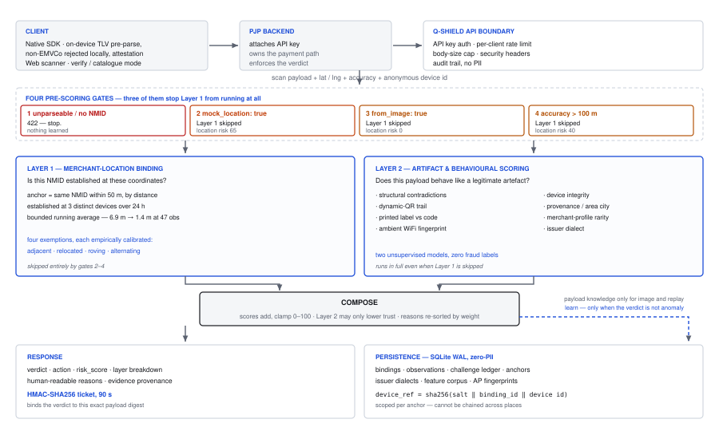
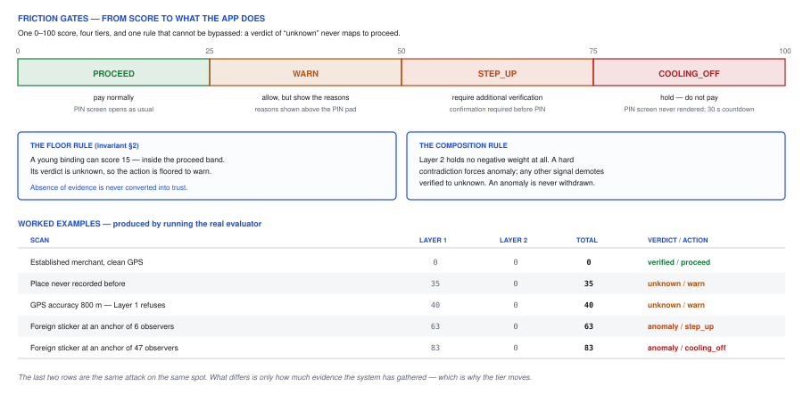

<div class="cover">

# Q-Shield

## A Pre-Payment Trust Layer for QRIS

### Detecting sticker-swap fraud through geospatial merchant-identity binding

**HackNusa 2026 · Secure Digital Payments & Fintech**

Team — [isi nama tim]

Members — [isi nama anggota]

Institution — Telkom University

Repository — github.com/wcksnrdn/QShield

30 September 2026

</div>

# Chapter 1 — Introduction & Background

## 1.1 QRIS Adoption

QRIS, Indonesia's national QR payment standard, was implemented by Bank
Indonesia via Payment Administrative Order No. 21/18/PADG/2019 with the
Indonesian Payment System Association (ASPI). Built on the EMVCo QR
specification, it is fully interoperable: one code displayed by a street
vendor can be paid from any authorised wallet or banking app.

By the end of 2025, QRIS recorded the highest transaction-volume growth
of any payment system in Indonesia — up 139.9% year-on-year, reaching
59.53 million users and 42.75 million merchants (Bank Indonesia, 2026).
As of mid-2025, **93.16% of its merchants are SMEs** (Bank Indonesia,
2025).

## 1.2 Physical Attack Surface

That reach creates an asymmetric *physical* attack surface. QRIS displays
used by most MSMEs are static codes printed on paper, laminated cards, or
acrylic stands. Unlike POS terminals they are passive data carriers: no
electronic display, no challenge–response, no tamper detection, and no
way to verify that the code belongs to the stall where it hangs. In
public markets, food courts, roadside stalls, and at donation boxes they
are routinely left unattended and physically accessible.

## 1.3 The Sticker-Swap Attack

The attacker forges nothing. They register a legitimate merchant account
with an authorised payment service provider (PJP), obtain an officially
issued, standards-compliant code, and place it over the original
merchant's. Every payment bypasses the merchant and reaches the attacker.

The press calls these "fake QR codes." They are not fake. **The code is
genuine; only its placement is deceptive.**

In April 2023 an individual placed such stickers at 38 mosques and prayer
rooms across Jakarta and Tangerang, generating IDR 13.06 million between
1–9 April (DW, 2023); the codes were labelled "Restorasi Masjid" and
linked to accounts registered in Medan and South Jakarta (Kompas, 2023).
In late September 2025, vendors at a Telkom University food court in
Bandung found the codes of roughly 10–20 stalls covered over, losing
IDR 30,000–1,000,000 per stall to stickers believed to have been applied
overnight (Kompas TV, 2025).

## 1.4 Why Inspecting the Code Is Not Enough

Before building a location layer we tested the cheaper hypothesis: can a
legitimate tag be told from a fraudulent one by inspecting the payload
alone? We extracted **16 structural and semantic attributes** from both
and compared them side by side (`scripts/enam_belas_ciri.py`, locked by
`tests/test_enam_belas.py`).

| Attribute class | Count | Differ between victim and attacker |
|---|---|---|
| Structural — set by the acquirer's generator | 12 | **0** |
| Descriptive — filled in by the merchant at registration | 4 | 2 |

**None of the 12 structural attributes differ** — field count and order,
CRC validity and casing, acquirer GUID, template number, sub-tag layout,
account-number length and prefix, NMID format, currency, country. Both
stickers were issued by the same compliant acquirer.

Two *descriptive* attributes do differ in our sample — merchant category
and merchant-name length — and **Layer 2 does score them**. But the
attacker fills those fields in himself at registration, so a careful
attacker erases the difference without changing the attack at all.

Re-measured against real data: across **52 field-collected merchants from
a single issuer**, five of six retained structural attributes are
identical for **all 52**. What varies is descriptive (21 category
variants, 35 city variants) — evidence that the 52 are different
businesses, not evidence of tampering.

> A classifier trained to recognise "what a real QRIS payload looks like"
> calls both tags real, because both *are* real. The fraud is not in the
> code; it is in the code's placement. Detecting it requires the one
> thing QRIS does not carry: **knowledge of where a code is supposed to
> be.**

# Chapter 2 — Solution Overview & Market Differentiation

## 2.1 Solution Overview

Q-Shield is a low-latency, zero-trust verification service the PJP calls
**synchronously before the PIN screen**, returning a verdict plus a
signed ticket the settlement path can require.

```
Camera feed → payload extraction → PJP backend → POST /api/v1/verify
            → dynamic friction gate → PIN entry
```

We state the boundary precisely, because overstating it is the fastest
way to lose a payments audience: **Q-Shield does not sit in the payment
path and cannot force any outcome.** The PJP executes the payment. What
Q-Shield produces is a verdict and a cryptographic binding of that
verdict to the exact code scanned. Enforcement belongs to the PJP, and in
the consortium model to the national switch. Recorded as R15 in
`docs/THREAT-MODEL.md`, and written into `src/qshield/ticket.py` as a
claim that must never be made.

**Layer 1 — Merchant-Location Binding.** Determines whether the scanned
National Merchant ID (NMID) is established at the user's coordinates
through distributed observer consensus. An *anchor* is a place where an
NMID has been repeatedly observed; it becomes established at **3 distinct
devices spanning ≥24 hours** and is maintained as a bounded running
average (positional error **6.9 m → 1.4 m after 47 observations**; drift
capped at 20 m even against 500 hostile devices).

**Layer 2 — Artifact & Structural Behavioural Scoring.** Seven signal
families: structural contradictions; dynamic-QR trail (reuse, spread,
re-pricing); printed label vs encoded content; ambient-WiFi fingerprint;
device integrity; provenance (area city, name consistency); and
unsupervised merchant-profile rarity.

**Layer 2 can only lower trust, never raise it.** There is not one
negative weight in `src/qshield/behavior.py`. Absence of a Layer 2 signal
is not evidence of legitimacy.

Both layers emit into one 0–100 score mapped to four friction tiers:

```
 0–25  proceed   26–50  warn   51–75  step_up   76–100  cooling_off
```

## 2.2 Unique Selling Proposition

**1. It verifies placement, not authenticity.** Every payload-inspection
product answers a question this attack does not fail (§1.4).

**2. It is built to be wrong safely.** A third state, `unknown`, never
maps to `proceed`. Absence of evidence is never converted into trust —
enforced structurally, not by weight tuning (invariant §2).

**3. Its false-positive cost is measured, not asserted.** Indonesian
street commerce breaks naive geospatial rules constantly: vendors share
one spot by time of day, carts rove, stalls stand centimetres apart. Each
was found in the field, measured, and given an evidence-based exemption —
not a threshold loosened until complaints stopped (§3.2).

**4. Its limits are published**, with the measurement behind each (§5.4).

**5. Its value compounds across PJPs.** One wallet's scan protects every
other wallet's users (§6.1).

# Chapter 3 — Proof of Concept & Repository References

<figure><figcaption><b>Figure 1 — Proof-of-concept architecture.</b> A scan enters through the PJP, passes four pre-scoring gates, and is evaluated by two independent layers whose results are composed into one verdict. Three of the four gates stop Layer 1 from running at all, while Layer 2 continues in full. The dashed path is the learning loop, which is deliberately narrower than the read path: an anomaly teaches the system nothing, and image or replay scans may only teach payload knowledge, never location.</figcaption></figure>

## 3.1 Repository Structure

A modifiable package under `src/qshield/`, separating evaluation logic
from persistence and network I/O.

| Module | Responsibility |
|---|---|
| `emvco.py` / `geo.py` | recursive EMVCo TLV parsing and CRC16; geohash-7 indexing with haversine distance |
| `binding.py` | Layer 1 spatial consensus, tier mapping |
| `behavior.py` / `profile.py` | Layer 2 signals; unsupervised rarity model |
| `store.py` | thread-safe SQLite WAL, anchor smoothing, zero-PII schema |
| `ticket.py` / `transfer.py` | HMAC-SHA256 tokens; manual bank-transfer channel |
| `api.py` / `web/index.html` | FastAPI surface; dual-mode scanner, single file, no build step |

Anchors are decided by **distance**, not geohash-cell equality; geohash-7
is only the query index. This was a real write-path defect (commit
`7311fcb`): one stall scanned by three phones within the same minute was
recorded as three places (2/1/1 observers, none reaching consensus)
because the scans fell either side of a cell boundary.

Every operational threshold is reproducible. `scripts/` holds 15
calibration programs — geohash precision, Layer 2 weights against 20,000
synthetic payloads, dynamic-QR thresholds, roving-vendor limits,
alternation, rarity, anomaly decay, relocation, coexistence, and
end-to-end friction on honest vendors. **20 test suites, all green**,
including 8 architectural invariants (`test_invariants.py`), 44
attacker-side scenarios (`test_adversarial.py`), 31 hardening checks, and
twelve behaviour-specific suites written for cases found in the field.

## 3.2 Layer 1 — Consensus and Its Four Exemptions

Beyond base consensus, Layer 1 resolves four situations that look
identical in the data and are not all fraud. **This is where most of the
engineering went, because a detector that accuses honest vendors is never
deployed — the cashier rejects it first.**

**(a) Adjacent merchants.** Two legitimate stalls at the same coordinates
(food court; juice cart beside a donation box). Coexistence is granted
when observer bases are comparable (ratio ≥ 0.10), or when physical
presence is proven: **8 distinct devices over 24 h, with the incumbent
still being scanned.** Closed as R11.

**(b) A merchant who relocated.** Scatter is re-scored as *relocation*
(weight 25 instead of 60) when 8 distinct devices appear at the new
place, all old locations have gone quiet, and active periods never
overlapped. Closed as R12.

**(c) A roving merchant.** A mobile coffee cart and a batch of scattered
stickers produce the *same* symptom. What separates them is not
statistics but physics — **one cart can only be in one place at one time;
five stickers applied at once live in five places simultaneously.** An
accusation therefore requires positive proof of simultaneous presence:
two cross-area observations too close in time for anyone to travel
between (`calibrate_keliling.py`).

| Speed limit | Push-carts accused | Motorised vendors accused | Scatterers caught |
|---|---|---|---|
| 20 km/h | 0.0% | 89.5% | 13.2% |
| 40 km/h | 0.0% | 23.2% | 6.8% |
| **80 km/h** | **0.0%** | **0.0%** | **3.8%** |

80 km/h was chosen for vendor safety, not catch rate (measured p99 for
motorised vendors: 69.6 km/h). A second limit bounds daily range at 80 km
(metropolitan roving p99 53.6 km; intercity scattering reaches 1,974 km).
Where neither test fires, multi-area presence scores as **ignorance, not
accusation** — weight 35, the same price as an unrecorded place.

**(d) One spot shared by time of day.** An iced-fruit cart works middays;
in the evening a different legitimate vendor takes the exact same spot.
Under the old path the second vendor was accused of sticker-swapping for
**3–9 days** — a cost paid by someone innocent, for a trading pattern
that is everyday in Indonesia.

The evidence was already in the data, unread: **alternation.** The
incumbent is scanned, then the challenger, then the incumbent *again*. An
overlay sticker structurally cannot produce that pattern — once it covers
the code beneath, that code can never be scanned again.

| Pattern | Incumbent re-appearances in 7 days |
|---|---|
| Legitimate shift-sharing | 6 |
| Overlay sticker (attack) | **0** |

The separation is **zero, not merely small**, so a genuine overlay never
passes this path at any threshold. With alternation proven the device
requirement drops from 8 to 4, and a quiet stall is accepted on day 5
instead of day 9. Verified end-to-end in `tests/test_bergiliran.py`,
including the three-vendor case where a challenger faces two established
anchors at once.

## 3.3 Layer 2 — Artefact Scoring

Weights and their justification are in `docs/KALIBRASI-BOBOT.md`.
Representative:

| Signal | Weight | Basis |
|---|---|---|
| Structural contradiction (static QR with an amount; missing mandatory tag; malformed NMID or country) | 70, hard | a compliant acquirer cannot issue it |
| Printed NMID ≠ encoded NMID | 75, hard | direct overlay evidence, works on the first scan |
| Dynamic QR spread >150 m | 55 | 0.000% false positives (GPS error p99.9 = 34 m) |
| Implausible accuracy claim (<1.0 m) | 45 | no consumer GNSS reports below ~3 m |
| Dynamic QR reused ≥4× | 30 | 0.60% false positives |
| Issuer-dialect deviation | 18, capped 45 | a hint, not proof |
| Rare merchant profile (≥3 of 16 attributes rare) | 25 | 4.1% false positives on the real field corpus |
| Encoding fingerprint (tag order, CRC casing) | 15 / 10, capped 25 | **UNCALIBRATED** — capped so it can never move a tier alone |

Two are unsupervised models built from a corpus we collected ourselves,
with **no fraud labels at all** — because confirmed fraud examples do not
exist, and a supervised classifier cannot be trained without them.
*Issuer dialect* learns how each PJP's generator assembles a payload; a
code claiming that issuer but not following its dialect was re-generated
by someone else. *Merchant-profile rarity* flags payloads carrying
several rare attribute values at once, and **names which attribute is
rare and how rare** — an opaque verdict has no place in a payment system.
Leave-one-out against **122 real field-collected merchants** flags 5, a
**4.1% false-positive rate**.

## 3.4 Persistence, Zero-PII, and API Surface

SQLite in WAL mode behind a single shared connection with explicit
locking, written for correctness under concurrency (Postgres migration
plan in `docs/DEPLOY.md`).

The schema is designed for UU PDP alignment: **no names, no phone
numbers, no user GPS traces.** What is stored is *how many distinct
devices*, never *which*. The device reference is
`sha256(salt ‖ binding_id ‖ device_anon_id)` — **scoped per anchor**, so
one phone yields a different reference at every place and cannot be
chained into a movement trail. This is verified adversarially:
invariant 8 enumerates the live schema (**69 columns, 13 tables**) then
attacks it — JOIN, cross-location linkage, and reference-counting attacks
all fail while de-duplication still works.

Ten endpoints. Beyond `POST /api/v1/verify`: `/inspect` (payload analysis
without coordinates, for corpus building), `/tickets/verify` (settlement
side), `/merchants` and `DELETE /merchants/{nmid}` (PJP registration and
revocation — the fast path out of cold start and relocation, so consensus
is the fallback for the unregistered majority rather than the only
route), `/assess-transfer` and `/beneficiary-reports` (manual bank
transfer, where there is no artefact at all — the module receives
telemetry from the PJP rather than collecting it, and scores the
*destination* account, which in a fraud scenario is the perpetrator),
`/field`, and `/health`.

# Chapter 4 — Technical Architecture & Feasibility

## 4.1 System Flow

The app captures payload and GPS and routes them through the PJP backend,
which attaches its API key and calls `POST /api/v1/verify`.

**Four gates run before any scoring**, and three deliberately stop
Layer 1 from running at all:

| Gate | Condition | Effect |
|---|---|---|
| 1 | payload unparseable, or no NMID | **422, stop** — no verdict, no ticket, nothing learned |
| 2 | `mock_location: true` | Layer 1 not run; location risk pinned at **65** |
| 3 | `from_image: true` | Layer 1 not run; location risk **0** |
| 4 | `accuracy_m > 100` | Layer 1 not run; location risk **40** |

In gates 2–4 **Layer 2 still runs in full**: a malformed payload is
malformed regardless of GPS quality, and discarding that evidence because
a different sensor failed throws away healthy proof.

<figure><figcaption><b>Figure 2 — Friction gates.</b> One 0–100 score maps to four tiers, each with a defined client behaviour. Two structural rules protect the mapping: a verdict of <i>unknown</i> can never produce <i>proceed</i>, and Layer 2 carries no negative weight, so a clean payload can never buy back trust that Layer 1 withheld. The last two example rows are the same attack at the same spot — only the accumulated evidence differs.</figcaption></figure>

Gate 4 is invariant §6 — with an 800 m confidence radius, hundreds of
shops fit inside the circle, and scoring an anchor against it is not a
less accurate judgement but a meaningless one. Gate 2 is the same logic
priced higher, because bad accuracy is misfortune while a mock provider
is intent. Gate 3 covers remote payment (a code photographed and sent to
a friend to pay): the payer's coordinates are real but say nothing about
where the sticker hangs.

Otherwise both layers evaluate and compose under three rules: scores add
and clamp to 0–100; Layer 2 can only worsen status (a hard contradiction
forces `anomaly`, any other signal demotes `verified` to `unknown`, and
an `anomaly` from Layer 1 is never withdrawn); and the same four tiers
apply, with no new scale introduced. Reasons from both layers are
**re-sorted by actual weight** before display, because users read from
the top and often stop at the first line.

**What the system learns** depends on the verdict:

| Outcome | Learns |
|---|---|
| `anomaly` | nothing — a fraudulent sticker must never build reputation (invariant §3) |
| replay or `from_image` | payload knowledge only (issuer dialect, rarity) — never location |
| clean field scan | anchor, area city, ambient-WiFi fingerprint, and payload knowledge |

That second row came from a real incident: a team member catalogued codes
from the internet while sitting in an office, and seven codes from
Karanganyar to Mandailing Natal were all recorded at one point in
Jakarta, corrupting that area's learned city.

On a **location-related** anomaly, two records are written from opposite
viewpoints — the anchor's attempt counter, and the rejected NMID entered
in a **challenge ledger**. That ledger is the route back for honest
vendors; the shift-sharing and relocating vendors both prove themselves
through it. Payload-only defects mark nothing, a fix driven by
production, where seven genuine merchants at one point had inherited four
anomaly attempts that all came from defective scam codes scanned there.

Every response carries an HMAC-SHA256 ticket valid for 90 seconds. On
`cooling_off` the reference client never renders the PIN screen — it is
not hidden by CSS, it is never constructed — and shows a 30-second
countdown, because delay breaks time pressure while refusal only sends
the victim looking for another route.

## 4.2 Measured Performance

200 sequential `POST /api/v1/verify` requests over local SQLite,
re-measured 30 September 2026:

```
p50 0.8 ms     p95 0.9 ms     p99 1.2 ms     max 5.1 ms
```

Against a 200 ms budget, roughly two hundred times faster than required.
Two caveats stated plainly: **this is not production volume** — a local
instance with a small corpus, showing the algorithm is not the
bottleneck, not that production capacity is proven. And an earlier
version was far slower for a real reason: the simultaneous-presence
computation was O(n²), taking **481 ms at 1,000 observations**; it is now
O(k² + n log n), measured at **2.6 ms** on the same input, with two
concurrency defects that lost 1 observation in 200 fixed alongside.

# Chapter 5 — Security Architecture & Intellectual Property

## 5.1 Threat Matrix

| ID | Threat | Impact | Defence | Verification |
|---|---|---|---|---|
| T1 | Physical sticker overlay | High | consensus weight `60 + min(25, observers/2)`; `cooling_off` at ≥32 independent observers (83 at 47) | `test_invariants.py`, `test_bobot.py` |
| T2 | Sybil cold-start flooding (<5 devices) | High | ≥3 distinct devices over 24 h; ratio 0.10 blocks the minimum-capital attack | `test_adversarial.py` |
| T3 | Dynamic-QR reuse / invoice tampering | Med | tag-62 bill tracking, 48 h TTL; spread >150 m, reuse ≥4× | `test_adversarial.py` |
| T4 | Client-side TOCTOU bypass | High | stateless HMAC-SHA256 ticket | `test_ticket.py` |
| T5 | Database compromise / user tracking | High | zero-PII schema; anchor-scoped device hashing | `test_invariants.py` |
| T6 | OS-level mock-location spoofing | Med | dedicated gate: Layer 1 refuses to run, risk pinned at 65; attestation vouched by the PJP | `test_hardening.py` |
| T7 | Implausible accuracy claim | Med | accuracy below 1.0 m flagged at weight 45 | `test_adversarial.py` |
| T8 | Overlay under unusable GPS | Med | ambient-WiFi fingerprint recognises the place; a foreign NMID there escalates to `step_up` | `test_adversarial.py` |
| T9 | Forged consensus via synthetic device IDs | High | **disclosed, not closed** — every verdict carries `evidence.vouched_observers` and a `consensus_unvouched` signal | `test_konsensus.py` |
| T10 | False accusation of legitimate vendors | High | four calibrated exemptions (§3.2) | `test_keliling.py`, `test_bergiliran.py` |

T9 and T10 are in this table deliberately. T9 is a weakness we found in
our own system and chose to publish; T10 treats harm to honest merchants
as a first-class threat.

## 5.2 Verification Ticket

A TOCTOU attack substitutes a different code between authorisation and
execution. Every verdict therefore carries the SHA-256 fingerprint of the
scanned payload plus the verdict, signed with HMAC-SHA256 and valid 90
seconds. Before settling, the PJP approves only if all four hold:

```
SHA-256(P_pay) = T.fp  ∧  HMAC-Verify(K_PJP, T)  ∧  Now < T.exp  ∧  T.action ∈ A_allowed
```

**What the ticket does not do**, stated because a payments audience will
find it anyway. It **binds but does not compel** — a PJP that ignores
`cooling_off` will ignore the ticket too; real enforcement requires the
switch to refuse settlement without a valid ticket, which is
infrastructure-level, not library-level (R15). It **does not prevent
replay** — stateless and unstored, so the same code can settle twice
inside its window; idempotency belongs to the PJP (R16). HMAC rather than
asymmetric signatures is a deliberate dependency trade-off whose
consequence is recorded as R14.

## 5.3 Intellectual Property Potential

**Method 1 — Multi-entity spatial consensus for offline payment terminal
verification.** Crowdsourcing trusted merchant anchors across disparate
payment service providers using bounded running-average coordinate
convergence and location-scoped hashing, so that participation
strengthens a shared map without any participant contributing personal
data.

**Method 2 — Alternation-based resolution of terminal coexistence
conflicts.** Resolving conflicts at a shared physical location without
manual onboarding, by requiring proof of **alternation** — repeated
re-appearance of the incumbent terminal after a challenger's entry. The
novelty is structural, not statistical: an overlay sticker cannot produce
this pattern at all, because once it covers the code beneath that code
can never be scanned again. Measured separation is **zero versus six
re-appearances per week**, not a margin requiring a tuned threshold.

**Method 3 — Decoupled pre-PIN verification ticket protocol.** A
handshake generating an in-flight HMAC-SHA256 token binding a pre-PIN
risk verdict to the raw settlement payload digest under a short TTL,
allowing the verifying and settling parties to be different institutions.

## 5.4 Acknowledged Limits

Published in full in `docs/THREAT-MODEL.md`. Six remain open.

| ID | Limit | What closes it |
|---|---|---|
| **R19** | The rarity model is blind to an attacker copying a common profile — measured against 122 real merchants, profile-copiers pass | not this layer: issuer dialect catches re-generated payloads, geospatial binding catches placement |
| **R20** | A sticker swapped *before* being photographed cannot be caught from the payer's side — a photo carries no place | protection must happen when photographing: an in-place scan, or a ticket for PJP-to-PJP integration |
| **R21** | Stickers scattered within one city, rarely scanned, are not separable from a roving vendor — only **3.8%** leave the proof | observation density; this evidence grows with adoption, with no tuning |
| **R22** | Consensus can be forged with synthetic device identities — three invented strings spread past the age threshold turn a new anchor `verified` | not a higher threshold (counting forgeable numbers still counts forgeable numbers): PJP registration, or attested observers |
| **R23** | Time thresholds do not burden an attacker who need not be present — "three different days" means three HTTP requests from a laptop | recorded as a decision *not* taken, with its reasoning, so it is not revisited |
| **R24** | Part-time swapping is not separable from shift-sharing | not detection but cost: he must attend twice daily, forever, while letting his victim collect half the payments |

The honest summary of R21 and R24: the attack we actually defend against
— an overlay on an established merchant — is untouched by either. It is
caught at `cooling_off`, and the attacker never builds an anchor at all,
because rejected scans build no reputation.

## 5.5 Architectural Invariants

Eight decisions are locked by a regression suite whose purpose is to
*attempt to violate them* on every run. They are not features; features
may be replaced, invariants may not.

§1 geohash precision 7, not 8 (precision 8 covers only 44.4% of a 100 m
radius under GPS drift; 7 covers 100%). §2 `unknown` never means safe.
§3 rejected scans never build reputation. §4 four friction tiers, no
fifth scale. §5 the consensus formula is locked as written, because its
figures are quoted publicly. §6 GPS accuracy >100 m refuses a location
verdict. §7 adjacent merchants are not sticker-swaps. §8 no user identity
in the schema.

# Chapter 6 — Scalability & Deployment Readiness

## 6.1 Deployment Topologies

**Model A — single PJP, private.** Q-Shield runs inside the PJP's own
infrastructure. No data leaves the PJP; the merchant map is built only
from that PJP's users.

**Model B — shared consortium.** All PJPs query one instance before the
PIN screen, over a single merchant-location map built from every app's
scans and containing no personal data. **A scan by one app's user
protects every other app's users.** After the PIN, the national switch
checks the verification ticket before settlement proceeds.

A PJP can start with Model A and join Model B later. The difference is
demonstrable rather than rhetorical: `scripts/demo_lintas_pjp.py` runs
both worlds side by side over an identical event sequence, so the causal
link is visible — on two phones a judge sees only two screens and cannot
see that protection on the second came from a scan on the first.

## 6.2 Native Mobile SDK Seam

The Android (Kotlin) boundary is defined in `sdk/README.md`, backed by
**ten request/response fixtures** in `sdk/contract/` generated from the
code plus an OpenAPI schema, kept fresh by `tests/test_sdk_contract.py`.

**On-device pre-parsing.** The SDK parses EMVCo TLV in native memory;
non-EMVCo codes (URLs, phishing links) are rejected locally with no HTTP
round trip.

**Device attestation slot.** The client gathers attestation via Play
Integrity or App Attest and populates `device_integrity`
(`mock_location`, `rooted`, `attested`, `platform`). The trust chain is
explicit: **Q-Shield cannot verify these fields.** What gives them
meaning is `attested` — a result the PJP verifies on its own side and
stands behind with its API key. We do not trust the device; we trust the
PJP that says it checked. A scan counts as *vouched* only when
attestation is present **and** the client is authenticated.

**Open SDK items, stated rather than implied:** timeout and offline
fallback behaviour are a PJP integration decision and are not yet
specified in the contract; the gallery-input control for the `from_image`
path is not built, though the backend side is complete and tested.

## 6.3 Dual-Mode Web Scanner

`src/qshield/web/index.html` is a single file with no build step. It
steers camera selection away from the ultra-wide (0.5×) lens toward the
1× main camera with continuous autofocus — written after a real failure
where `facingMode: "environment"` selected an ultra-wide lens whose
minimum focus distance made QRIS codes unreadable on some phones.

**Verification mode** (`/verify`) captures live GPS and emits full risk
scoring; **catalogue mode** (`/inspect`) dispatches raw payloads without
coordinates for corpus building and merchant-side auditing. A **replay
mode** exists for indoor demonstration, where GPS routinely reports
accuracy above 100 m and invariant §6 correctly refuses a verdict.
Replayed scans are marked in four places — request, response, leading
reason, and audit trail — scoring is unchanged, and replay cannot bypass
the accuracy invariant (`tests/test_hardening.py`).

## 6.4 Current Deployment Status

The service is containerised and deployed (Fly.io, Singapore region),
with configuration and secrets handling documented in `docs/DEPLOY.md`.
Persistence is SQLite in WAL mode; the migration path to Postgres is
written out rather than assumed, including the four things SQLite makes
us do by hand that Postgres provides natively — connection pooling,
concurrent writers, replication, and per-role access control.

The field corpus behind every empirical claim in this report was
collected by the team: **122 real merchants across 10 issuers**, five of
which currently pass the dialect-profile threshold. This is also the
honest limit on the issuer-dialect model, recorded as R7 — a
profile forms only for issuers whose generators are demonstrably
consistent, and five issuers is a thin base that grows with catalogue
mode.

What is *not* production-ready is stated as plainly: single-node SQLite,
one region, no load testing at transaction volume, and the SDK items in
§6.2. The system is a working proof of concept with measured behaviour,
not a deployed payment control.

## 6.4 Reproducing Every Number in This Report

```
tests/test_invariants.py          the eight invariants
tests/test_bobot.py               every weight quoted here
scripts/enam_belas_ciri.py        §1.4, the 16 attributes
scripts/calibrate_keliling.py     roving-vendor table
scripts/calibrate_bergiliran.py   alternation: 6 vs 0
scripts/evaluate_rarity.py        4.1% false positives
scripts/demo_lintas_pjp.py        Model A vs Model B
```

Supporting documents: `docs/THREAT-MODEL.md` (R1–R24),
`docs/KALIBRASI-BOBOT.md` (why each weight is what it is),
`docs/API.md` (contract and versioning), `docs/PROCESS-LOG.md`
(decision history).
